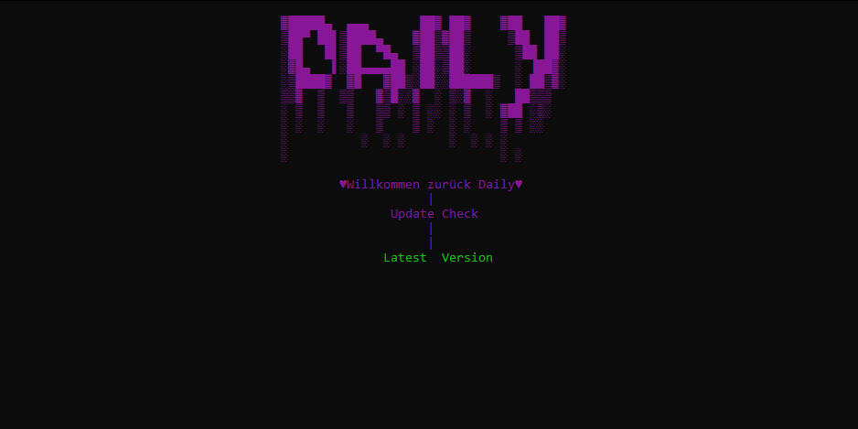

  
    

  
  
  
  # Tutorial 🌠
  Its easy just download the tool and make sure u disabled the windows defender because sometimes the tool will deleted or mark as a virus but it's not. After you complete the download open valorant and the tool at least.

  <b>
  I will publish the tool first in German but dont worry i work on the english version.
  If the Version is out u will see a update announcement on the programm.

 

  
## Support

  if you like what i do, maybe consider buying me a coffee/tea   
  
<!-- 
  

  -->
  

  

